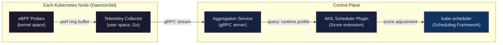

# AKIL — Adaptive Kernel Intelligence Layer

**Runtime-Aware Container Scheduling for Kubernetes**

> *Operating Systems — Course Project*
> *Prepared: August 2026*

---

## Overview

AKIL is a Kubernetes scheduling extension that uses **eBPF-based kernel telemetry** to make container placement decisions informed by actual OS-level runtime behavior — not just static resource requests.

The system continuously collects fine-grained kernel signals (page fault rate, cache miss rate, lock/mutex contention, context-switch frequency) from running workloads, aggregates them into queryable per-workload runtime profiles, and feeds those profiles into a custom Kubernetes scheduler plugin at **Score time**. The result: placement decisions that account for what the kernel *actually observes* about workload behavior, closing an information gap that the default `kube-scheduler` ignores entirely.

---

## Problem Statement

Kubernetes' default scheduler (`kube-scheduler`) makes placement decisions using **static, coarse-grained infrastructure metrics**: requested/available CPU, memory, node labels, taints/tolerations, and declared affinity rules. These metrics reveal nothing about what actually happens inside the operating system kernel once a workload is running:

- **Page fault frequency** — invisible to the scheduler
- **Cache locality** — invisible to the scheduler
- **NUMA memory access latency** — invisible to the scheduler
- **Lock and mutex contention** — invisible to the scheduler
- **I/O wait behavior** — invisible to the scheduler

This creates a systematic blind spot: two pods with identical resource requests can have entirely different runtime behavior, yet the scheduler treats them identically. The consequences are avoidable:

| Symptom | Root Cause |
|---|---|
| Increased memory access latency | Poor NUMA placement |
| Cache thrashing | Destructive co-location of cache-competing workloads |
| Reactive failure handling | Kubernetes responds *after* OOM kills / failed probes, not before |

**The core problem**: container orchestration scheduling decisions are made with strictly less information than the operating system already possesses about workload behavior, and no standard mechanism currently closes that information gap at scheduling time.

---

## Literature Review

| Prior Work | Contribution | Gap (not covered) |
|---|---|---|
| **Google Borg / Autopilot** | Large-scale resource-usage prediction and reactive adjustment | Kernel-level runtime behavior (cache, lock contention, page faults) as a scheduling input |
| **Firmament** (Cambridge) | Flow-network optimization for scheduling quality | New runtime telemetry signal acquisition |
| **Kubernetes Topology Manager** | NUMA/device-level topology hints for CPU pinning | Dynamic, continuously observed runtime signals (contention, cache misses) |
| **Cilium / Pixie / Parca** | Low-overhead eBPF telemetry at production scale | Closing the loop into a live scheduler decision |

AKIL sits in the gap between **observability tooling** (which collects the signals but doesn't act on them) and **scheduling systems** (which act but lack these signals).

---

## Architecture



### Data Flow

1. **eBPF Probes** (kernel space) — attached to tracepoints and perf events, sampling page faults, cache misses, lock contention, and context switches per-cgroup (container).
2. **Telemetry Collector** (user-space DaemonSet) — reads events from perf ring buffers, tags them with pod/container identity via cgroup-to-pod mapping, and streams structured telemetry to the aggregation service.
3. **Aggregation Service** — receives streams from all nodes, maintains a sliding-window runtime profile per workload, and exposes a low-latency gRPC query API.
4. **Scheduler Plugin** — registered as a `Score` plugin in the Kubernetes Scheduling Framework. At scheduling time, queries the aggregation service for the candidate pod's workload profile and co-located workload profiles on each candidate node, then adjusts the node score to penalize destructive co-location (cache thrashing, lock contention overlap) and reward affinity (complementary memory access patterns, NUMA alignment).

---

## Project Objectives

### General Objective

Design and implement a working, kernel-telemetry-informed scheduling extension for Kubernetes, and evaluate whether incorporating OS-level runtime signals into scheduling decisions measurably improves placement quality relative to the default scheduler.

### Specific Objectives

1. **Telemetry Collection** — Implement a low-overhead eBPF-based kernel telemetry collector sampling page fault rate, cache miss rate, lock/mutex contention, and context-switch frequency on a per-workload basis.
2. **Aggregation Layer** — Build an aggregation service that converts raw kernel events into a stable, low-cardinality runtime profile queryable within a scheduler's latency budget.
3. **Scheduler Plugin** — Implement a Kubernetes scheduler plugin using the standard Scheduling Framework that scores candidate nodes using the aggregated runtime profile alongside standard resource-based criteria.
4. **Benchmark Design** — Design and run a synthetic, deliberately memory- and cache-sensitive benchmark workload capable of exposing a measurable difference between default and telemetry-aware placement.
5. **Quantitative Evaluation** — Compare latency, cache-miss rate, and migration/eviction counts between default `kube-scheduler` placement and AKIL-informed placement on identical workloads and cluster conditions.
6. **Documentation** — Document the system's architecture, evaluation results, and scoped novelty claim suitable as a course deliverable and starting point for future prior-art assessment.

### Explicitly Out of Scope (This Phase)

- Predictive migration based on trend forecasting
- Reinforcement-learning-based policy refinement across deployments
- Energy/thermal-aware scheduling
- Behavioral-fingerprint-based security quarantine

*(These are documented as future extensions only.)*

---

## Novelty / Innovation

The claim is **intentionally narrow** — neither kernel-level telemetry collection nor NUMA/topology-aware scheduling is independently novel. The contribution is in **the combination and the closed-loop architecture**:

1. **Continuous kernel-level behavioral telemetry** — not just resource usage — collected via eBPF, covering signal types (lock contention, cache locality) not currently exposed to Kubernetes' scheduler.
2. **A defined aggregation step** that converts telemetry into a per-workload runtime profile cheap enough to query synchronously inside a live scheduling decision (closing the gap against Cilium/Pixie/Parca).
3. **A scheduler plugin** built on the standard Kubernetes Scheduling Framework, consuming this profile at Score time — closing the loop from kernel behavior to placement decision within the workload's own runtime.

> This claim is a **hypothesis to validate**. The evaluation results from Objective 5 are what will ultimately determine whether it holds up.

---

## Tech Stack

| Layer | Technology | Rationale |
|---|---|---|
| **Language** | **Go 1.22+** | Kubernetes-native; the Scheduling Framework API is Go. Avoids CGo for eBPF via cilium/ebpf. |
| **eBPF Library** | **cilium/ebpf** (pure Go, CO-RE) | Production-proven (powers Cilium, Tetragon). CO-RE (Compile Once, Run Everywhere) avoids kernel-header dependencies at deploy time. Pure Go — no CGo, no libbpf C dependency. |
| **eBPF Programs** | **C** (restricted kernel C) | eBPF bytecode is compiled from C; this is unavoidable. Compiled to `.o` ELF via `clang`/`llvm` with BTF, then loaded by the Go userspace via cilium/ebpf. |
| **Inter-component RPC** | **gRPC + Protocol Buffers** | Low-latency, streaming-capable, strongly typed. Standard for K8s ecosystem services. Collector→Aggregator uses bidirectional streaming; Plugin→Aggregator uses unary RPCs. |
| **Aggregation Store** | **In-memory sliding-window ring buffer** | The scheduler's latency budget is ~milliseconds. An in-memory store with per-workload profiles avoids any external DB dependency on the hot path. |
| **Observability Export** | **Prometheus client_golang** | For dashboards and debugging — *not* on the scheduler's critical path. Exports collector health, aggregation latency, profile cardinality, scoring distributions. |
| **Build System** | **Go modules + Makefile + Docker multi-stage** | `make build` for local, `make image` for container images. Multi-stage Dockerfiles keep images minimal. |
| **eBPF Compilation** | **clang 15+ / llvm** with `bpf2go` (cilium/ebpf code generator) | `bpf2go` generates Go bindings from C eBPF programs at build time — zero runtime compilation. |
| **Kubernetes Integration** | **Kubernetes Scheduling Framework (v1.29+)** | The official, supported plugin API for custom scheduler logic. Plugin registers at the `Score` extension point. |
| **Deployment** | **Helm 3 charts** | Deploys: DaemonSet (collector), Deployment (aggregator), scheduler plugin config. Values file for tuning. |
| **Local Dev Cluster** | **kind** (Kubernetes in Docker) | Lightweight local clusters for development and integration testing. Supports multi-node topologies. |
| **Testing** | **Go `testing` + `testify`** (unit), **kind + e2e framework** (integration) | Unit tests for aggregation logic and scoring. Integration tests deploy the full pipeline on a kind cluster with synthetic workloads. |
| **CI** | **GitHub Actions** | Lint (`golangci-lint`), unit tests, eBPF build verification, kind-based integration tests. |

### Why These Choices

- **Pure Go eBPF (cilium/ebpf) over libbpf + C loaders**: Eliminates CGo, simplifies cross-compilation, reduces container image size, and keeps the entire userspace codebase in one language. The tradeoff (less low-level control than raw libbpf) is acceptable — AKIL's probes are standard tracepoint/perf-event attachments, not exotic XDP or TC programs.
- **gRPC over REST/HTTP**: The collector-to-aggregator path is a high-frequency event stream; gRPC streaming is purpose-built for this. The plugin-to-aggregator path needs sub-millisecond unary queries; gRPC's binary framing and connection multiplexing outperform HTTP/JSON.
- **In-memory store over Prometheus/Redis on the hot path**: The scheduler plugin must return a score within its latency budget. Querying an external time-series DB would add unacceptable latency and a failure dependency. Prometheus is used *alongside* for observability, not *as* the query backend.

---

## Project Structure (Planned)

```
akil/
├── cmd/
│   ├── collector/          # DaemonSet binary — eBPF loader + gRPC client
│   ├── aggregator/         # Aggregation service binary — gRPC server
│   └── scheduler-plugin/   # Scheduler plugin binary — Scheduling Framework
├── pkg/
│   ├── ebpf/               # eBPF C programs + bpf2go generated Go bindings
│   ├── telemetry/          # Telemetry types, ring buffer reader, cgroup resolver
│   ├── profile/            # Runtime profile aggregation, sliding window logic
│   ├── scoring/            # Score computation from runtime profiles
│   └── proto/              # gRPC service definitions (.proto) + generated code
├── deploy/
│   └── helm/               # Helm chart (DaemonSet, Deployment, scheduler config)
├── hack/                   # Build scripts, kind cluster setup, benchmark runners
├── benchmarks/             # Synthetic workload definitions (Deployments, Jobs)
├── docs/                   # Architecture diagrams, evaluation methodology
├── AKIL_Project_Review_1.pdf
├── claude.md
└── README.md
```

---

## Getting Started

> **Status**: Phase 1 (Review) complete. Implementation is pending.
> Build and deployment instructions will be added as components are implemented.

### Prerequisites (Expected)

- Go 1.22+
- clang 15+ / llvm (for eBPF compilation)
- Docker
- kind (for local Kubernetes clusters)
- Helm 3
- Linux kernel 5.8+ (for BPF ring buffer support and CO-RE)

### Quick Start (Coming Soon)

```bash
# Clone
git clone <repo-url> && cd akil

# Build all binaries
make build

# Build container images
make image

# Create local kind cluster and deploy
make kind-up
make deploy

# Run benchmark
make benchmark

# View results
make results
```

---

## Project Status

| Phase | Status |
|---|---|
| Literature Review | ✅ Complete |
| Problem Statement | ✅ Complete |
| Objectives Definition | ✅ Complete |
| Novelty Scoping | ✅ Complete |
| Tech Stack Selection | ✅ Complete |
| Architecture Design | 🔲 Pending |
| Implementation | 🔲 Pending |
| Benchmarking | 🔲 Pending |
| Evaluation | 🔲 Pending |
| Final Documentation | 🔲 Pending |

---

## References

- Google Borg / Autopilot — Large-scale cluster management and resource sizing
- Firmament (University of Cambridge) — Min-cost flow scheduling optimization
- Kubernetes Scheduling Framework — Official plugin API documentation
- Kubernetes Topology Manager — NUMA-aware resource allocation
- Cilium / Pixie / Parca — eBPF-based observability at production scale
- cilium/ebpf — Pure Go library for eBPF

> A formal, citation-backed literature review with full academic references (OSDI/NSDI/EuroSys proceedings) is a required next step before any claims of novelty are finalized.

---

## License

*To be determined.*
