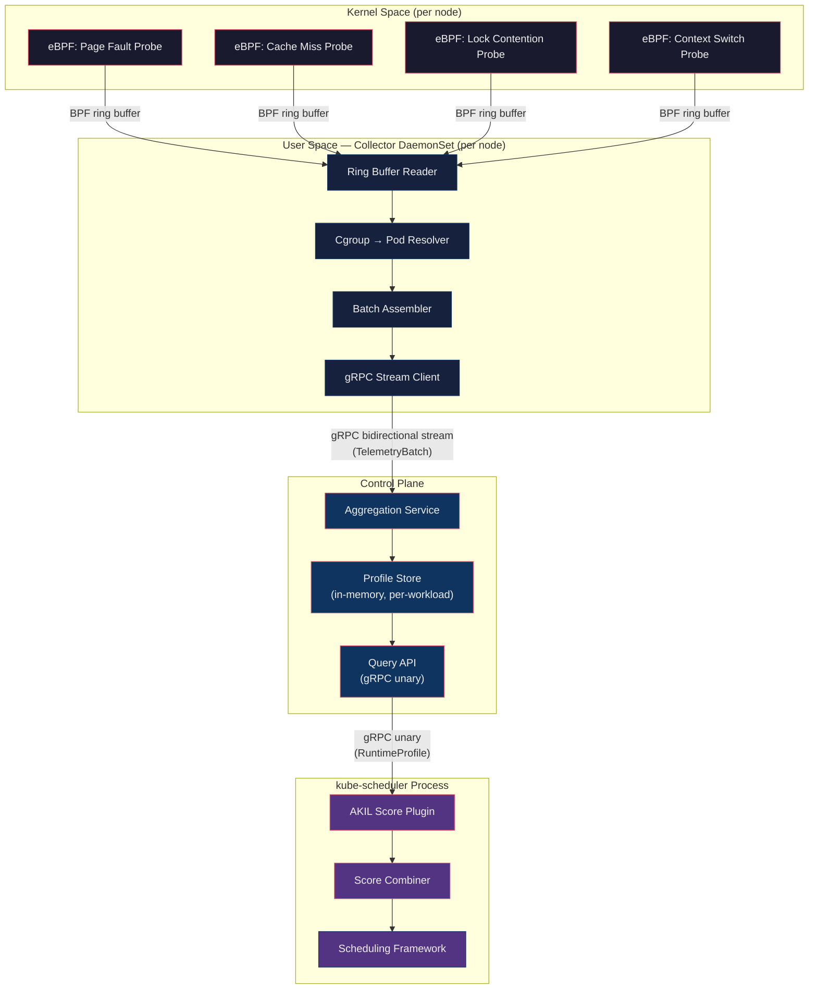
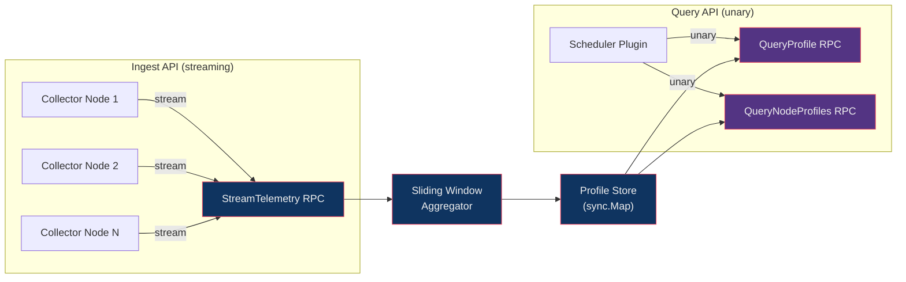
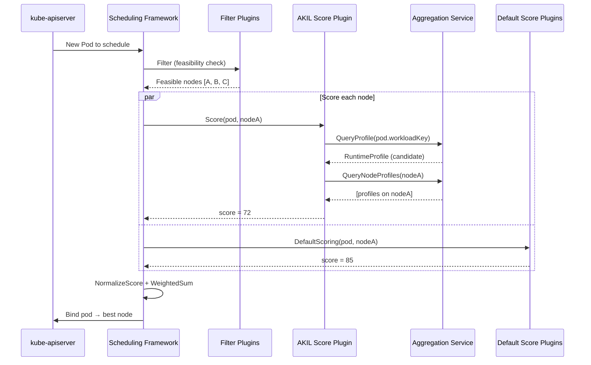
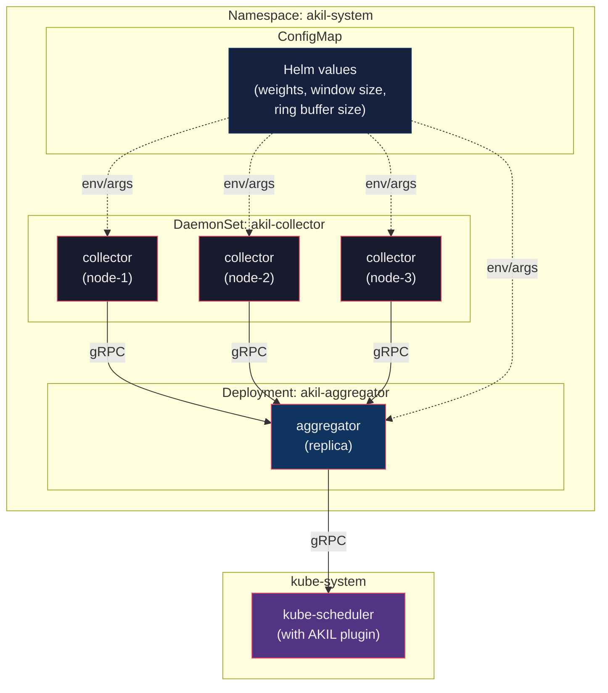

# AKIL — Adaptive Kernel Intelligence Layer

**Runtime-Aware Container Scheduling for Kubernetes**

> *Operating Systems — Course Project*
> *Prepared: August 2026*

---

## Overview

AKIL is a Kubernetes scheduling extension that uses **eBPF-based kernel telemetry** to make container placement decisions informed by actual OS-level runtime behavior — not just static resource requests.

The system continuously collects fine-grained kernel signals (page fault rate, cache miss rate, lock/mutex contention, context-switch frequency) from running workloads, aggregates them into queryable per-workload runtime profiles, and feeds those profiles into a custom Kubernetes scheduler plugin at **Score time**. The result: placement decisions that account for what the kernel *actually observes* about workload behavior, closing an information gap that the default `kube-scheduler` ignores entirely.

---

## Problem Statement

Kubernetes' default scheduler (`kube-scheduler`) makes placement decisions using **static, coarse-grained infrastructure metrics**: requested/available CPU, memory, node labels, taints/tolerations, and declared affinity rules. These metrics reveal nothing about what actually happens inside the operating system kernel once a workload is running:

- **Page fault frequency** — invisible to the scheduler
- **Cache locality** — invisible to the scheduler
- **NUMA memory access latency** — invisible to the scheduler
- **Lock and mutex contention** — invisible to the scheduler
- **I/O wait behavior** — invisible to the scheduler

This creates a systematic blind spot: two pods with identical resource requests can have entirely different runtime behavior, yet the scheduler treats them identically. The consequences are avoidable:

| Symptom | Root Cause |
|---|---|
| Increased memory access latency | Poor NUMA placement |
| Cache thrashing | Destructive co-location of cache-competing workloads |
| Reactive failure handling | Kubernetes responds *after* OOM kills / failed probes, not before |

**The core problem**: container orchestration scheduling decisions are made with strictly less information than the operating system already possesses about workload behavior, and no standard mechanism currently closes that information gap at scheduling time.

---

## Literature Review

| Prior Work | Contribution | Gap (not covered) |
|---|---|---|
| **Google Borg / Autopilot** | Large-scale resource-usage prediction and reactive adjustment | Kernel-level runtime behavior (cache, lock contention, page faults) as a scheduling input |
| **Firmament** (Cambridge) | Flow-network optimization for scheduling quality | New runtime telemetry signal acquisition |
| **Kubernetes Topology Manager** | NUMA/device-level topology hints for CPU pinning | Dynamic, continuously observed runtime signals (contention, cache misses) |
| **Cilium / Pixie / Parca** | Low-overhead eBPF telemetry at production scale | Closing the loop into a live scheduler decision |

AKIL sits in the gap between **observability tooling** (which collects the signals but doesn't act on them) and **scheduling systems** (which act but lack these signals).

---

## Architecture

### System Overview



---

### Layer 1: eBPF Telemetry Probes (Kernel Space)

Four independent eBPF programs, each attached to a specific kernel hook. All programs write events to a shared **BPF ring buffer** (one per node) keyed by cgroup ID.

#### Probe Specifications

| Probe | Attach Point | Event Data | Sampling Strategy |
|---|---|---|---|
| **Page Fault** | `tracepoint/exceptions/page_fault_user`, `page_fault_kernel` | `{ cgroup_id, timestamp_ns, fault_type (major/minor), address }` | Every event (low frequency per container) |
| **Cache Miss** | `perf_event` hardware counter: `PERF_COUNT_HW_CACHE_MISSES` | `{ cgroup_id, timestamp_ns, miss_count_delta }` | Sampled — one event per N misses (configurable, default N=10000) |
| **Lock Contention** | `tracepoint/lock/contention_begin`, `contention_end` | `{ cgroup_id, timestamp_ns, lock_addr, duration_ns }` (on `end`) | Every event; duration computed as `end - begin` per lock address |
| **Context Switch** | `tracepoint/sched/sched_switch` | `{ prev_cgroup_id, next_cgroup_id, timestamp_ns, prev_state }` | Every event; both outgoing and incoming cgroup IDs captured |

#### BPF Map Layout

```
BPF_MAP_TYPE_RINGBUF  — "events"       (per-node, shared across all 4 probes)
  ├── capacity: 16 MB (configurable via Helm values)
  └── event struct: { u8 event_type, u64 cgroup_id, u64 timestamp_ns, union { ... per-type fields } }

BPF_MAP_TYPE_HASH     — "lock_starts"  (used internally by lock contention probe)
  ├── key:   { u64 cgroup_id, u64 lock_addr }
  └── value: { u64 start_timestamp_ns }
  └── max_entries: 65536
```

**Design decision**: A single shared ring buffer (rather than one per probe) reduces the number of file descriptors and epoll loops in the collector. The `event_type` discriminator (`PAGE_FAULT=0`, `CACHE_MISS=1`, `LOCK_CONTENTION=2`, `CTX_SWITCH=3`) lets the collector demultiplex.

#### CO-RE and Portability

All eBPF programs use **CO-RE** (Compile Once, Run Everywhere) with BTF type information. Field offsets are resolved at load time by the cilium/ebpf library against the running kernel's BTF, eliminating kernel-header dependencies. Minimum kernel: **5.8** (BPF ring buffer support).

---

### Layer 2: Telemetry Collector (User-Space DaemonSet)

A Go binary deployed as a Kubernetes **DaemonSet** on every node. Responsible for: loading eBPF programs, reading the ring buffer, resolving cgroup IDs to Kubernetes pod identity, batching events, and streaming them to the aggregation service.

#### Internal Pipeline


#### Cgroup → Pod Resolution

The collector resolves kernel cgroup IDs to Kubernetes pod/container identity using:

1. **cgroupfs walk**: Reads `/sys/fs/cgroup/` hierarchy to map cgroup IDs to cgroup paths
2. **Path parsing**: Extracts container ID from the cgroup path (format varies by container runtime — containerd, CRI-O)
3. **Kubelet API**: Queries the local kubelet's `/pods` endpoint to map container ID → `(namespace, pod, container)` tuple
4. **Cache**: Maintains an LRU cache (TTL: 30s) of `cgroup_id → PodIdentity` mappings to avoid repeated lookups

```
PodIdentity {
    namespace:     string    // e.g., "default"
    pod_name:      string    // e.g., "web-frontend-5d4b8c7f9-x2k4j"
    container:     string    // e.g., "nginx"
    workload_key:  string    // owner reference — e.g., "default/Deployment/web-frontend"
    node_name:     string    // populated from downward API
}
```

The `workload_key` is critical — it identifies the workload *type* (Deployment, StatefulSet, Job) rather than the individual pod, enabling profile reuse across replicas.

#### Batching and Backpressure

- Events are accumulated into a `TelemetryBatch` protobuf message
- A batch is flushed when **either** 1000 events accumulate **or** 1 second elapses (whichever comes first)
- If the gRPC stream to the aggregator is down, events are dropped (not queued indefinitely) — the system is designed for *continuous observation*, not lossless audit logging
- A Prometheus counter `akil_collector_events_dropped_total` tracks dropped events for monitoring

#### Collector Prometheus Metrics

| Metric | Type | Description |
|---|---|---|
| `akil_collector_events_read_total` | Counter | Total events read from ring buffer, by event type |
| `akil_collector_events_dropped_total` | Counter | Events dropped due to backpressure or stream failure |
| `akil_collector_cgroup_cache_hit_ratio` | Gauge | LRU cache effectiveness |
| `akil_collector_batch_send_latency_seconds` | Histogram | gRPC batch send latency |
| `akil_collector_ebpf_load_errors_total` | Counter | eBPF program load failures |

---

### Layer 3: Aggregation Service (Control Plane Deployment)

A Go gRPC server deployed as a Kubernetes **Deployment**. Receives telemetry streams from all node collectors and maintains an in-memory, sliding-window **RuntimeProfile** per workload.

#### Dual gRPC API



#### gRPC Service Definition (Proto)

```protobuf
service AkilTelemetry {
  // Ingest: collector streams batches; aggregator acks with backpressure signals
  rpc StreamTelemetry(stream TelemetryBatch) returns (stream IngestAck);

  // Query: scheduler plugin requests profiles
  rpc QueryProfile(ProfileRequest) returns (RuntimeProfile);
  rpc QueryNodeProfiles(NodeProfilesRequest) returns (NodeProfilesResponse);
}

message TelemetryBatch {
  string node_name = 1;
  int64  batch_timestamp_ns = 2;
  repeated TelemetryEvent events = 3;
}

message TelemetryEvent {
  EventType event_type = 1;
  string    workload_key = 2;           // "namespace/Kind/name"
  int64     timestamp_ns = 3;
  oneof payload {
    PageFaultEvent    page_fault = 4;
    CacheMissEvent    cache_miss = 5;
    LockContentionEvent lock_contention = 6;
    ContextSwitchEvent  ctx_switch = 7;
  }
}

message RuntimeProfile {
  string workload_key = 1;
  double page_fault_rate = 2;           // faults/sec (sliding window avg)
  double cache_miss_rate = 3;           // misses/sec
  double lock_contention_ratio = 4;     // fraction of time in contention [0,1]
  double context_switch_rate = 5;       // switches/sec
  int64  sample_count = 6;             // events in current window
  int64  window_start_ns = 7;
  int64  window_end_ns = 8;
  ProfileConfidence confidence = 9;     // LOW / MEDIUM / HIGH based on sample_count
}

enum ProfileConfidence {
  UNKNOWN = 0;
  LOW = 1;      // < 100 samples in window
  MEDIUM = 2;   // 100–1000 samples
  HIGH = 3;     // > 1000 samples
}

message NodeProfilesRequest {
  string node_name = 1;
}

message NodeProfilesResponse {
  repeated RuntimeProfile profiles = 1;  // all workload profiles on this node
}
```

#### Sliding Window Aggregation

Each workload's `RuntimeProfile` is computed over a **configurable sliding window** (default: 60 seconds, configurable via Helm `values.yaml`).

```
┌──────────────────────────────────────────────────────────────┐
│                     Sliding Window (60s)                      │
│                                                              │
│  ┌─────────┬─────────┬─────────┬─────────┬─────────┬─────┐  │
│  │ Bucket 0│ Bucket 1│ Bucket 2│ Bucket 3│ Bucket 4│ ... │  │
│  │  (5s)   │  (5s)   │  (5s)   │  (5s)   │  (5s)   │     │  │
│  └─────────┴─────────┴─────────┴─────────┴─────────┴─────┘  │
│                                                              │
│  ◀──── oldest bucket rotated out ─── newest bucket ────▶     │
└──────────────────────────────────────────────────────────────┘
```

**Algorithm**:
1. The window is divided into **12 buckets of 5 seconds each** (= 60s total)
2. Incoming events are routed to the current (newest) bucket
3. Each bucket stores: `{ event_count, sum_page_faults, sum_cache_misses, sum_lock_duration_ns, sum_ctx_switches }`
4. Every 5 seconds, a timer rotates: the oldest bucket is evicted, a new empty bucket becomes current
5. On `QueryProfile()`, rates are computed by summing all non-evicted buckets and dividing by the window duration:
   - `page_fault_rate = total_faults / window_seconds`
   - `cache_miss_rate = total_misses / window_seconds`
   - `lock_contention_ratio = total_lock_duration_ns / (window_seconds × 1e9)`
   - `context_switch_rate = total_switches / window_seconds`

**Why sliding window over exponential moving average**: Sliding windows provide a hard upper bound on staleness (exactly `window_size` seconds of history) and are straightforward to reason about during evaluation. EMAs would weight recent data more heavily but make it harder to define a precise "memory horizon" for the scoring algorithm.

#### Profile Store Data Structure

```go
// ProfileStore is a concurrent-safe map of workload profiles.
// Key: workload_key (string, e.g., "default/Deployment/web-frontend")
// Value: *WorkloadProfile (contains the sliding-window buckets)
type ProfileStore struct {
    profiles sync.Map  // map[string]*WorkloadProfile
}

type WorkloadProfile struct {
    mu           sync.RWMutex
    workloadKey  string
    buckets      [12]Bucket    // circular buffer, 5s each
    currentIdx   int           // index of the current (newest) bucket
    lastRotation time.Time
    nodeLocations map[string]struct{} // set of nodes where this workload has pods
}

type Bucket struct {
    eventCount     int64
    pageFaults     int64
    cacheMisses    int64
    lockDurationNs int64
    ctxSwitches    int64
    startTime      time.Time
}
```

#### Aggregation Service Prometheus Metrics

| Metric | Type | Description |
|---|---|---|
| `akil_aggregator_profiles_active` | Gauge | Number of workload profiles in memory |
| `akil_aggregator_events_ingested_total` | Counter | Total events ingested, by type and node |
| `akil_aggregator_query_latency_seconds` | Histogram | Profile query response time |
| `akil_aggregator_stream_connections_active` | Gauge | Active collector streams |
| `akil_aggregator_bucket_rotations_total` | Counter | Window bucket rotations |

---

### Layer 4: Scheduler Plugin (Score Extension)

A Go plugin implementing the Kubernetes Scheduling Framework's **`ScorePlugin`** interface. Runs inside the `kube-scheduler` process (compiled as a custom scheduler binary).

#### Scheduling Framework Integration



#### Scoring Algorithm

The AKIL plugin produces a score in **[0, 100]** for each candidate node. The score starts at 100 (perfect) and is reduced by **penalty terms** for predicted co-location conflicts.

**Step 1 — Retrieve profiles**:
- `candidateProfile` = `QueryProfile(pod.workloadKey)` — the candidate pod's historical runtime profile
- `nodeProfiles[]` = `QueryNodeProfiles(candidateNode)` — profiles of all workloads already running on the candidate node

**Step 2 — Compute co-location penalties**:

For each existing workload profile `p` on the candidate node, compute pairwise penalties:

```
cachePenalty(candidate, p) =
    min(candidate.cache_miss_rate, p.cache_miss_rate) / max_cache_miss_rate
    × WEIGHT_CACHE

lockPenalty(candidate, p) =
    (candidate.lock_contention_ratio + p.lock_contention_ratio)
    × WEIGHT_LOCK

pageFaultPenalty(candidate, p) =
    (candidate.page_fault_rate + p.page_fault_rate) / max_page_fault_rate
    × WEIGHT_PAGE_FAULT

ctxSwitchPenalty(candidate, p) =
    (candidate.context_switch_rate + p.context_switch_rate) / max_ctx_switch_rate
    × WEIGHT_CTX_SWITCH
```

**Step 3 — Aggregate**:

```
totalPenalty = Σ (cachePenalty + lockPenalty + pageFaultPenalty + ctxSwitchPenalty)
             for each co-located workload on the node

score = max(0, 100 - totalPenalty)
```

**Step 4 — Confidence adjustment**:

If the candidate profile has `LOW` confidence (few samples), the penalty is dampened:
```
if confidence == LOW:   penalty *= 0.25
if confidence == MEDIUM: penalty *= 0.75
if confidence == HIGH:  penalty *= 1.0
```

This prevents undertested workloads from being unfairly penalized.

#### Default Scoring Weights (Configurable)

| Weight | Default | Description |
|---|---|---|
| `WEIGHT_CACHE` | 35 | Cache thrashing is the highest-impact co-location problem |
| `WEIGHT_LOCK` | 30 | Lock contention amplifies with co-location |
| `WEIGHT_PAGE_FAULT` | 20 | Memory pressure compounds but is partially handled by K8s resource limits |
| `WEIGHT_CTX_SWITCH` | 15 | Less directly affected by co-location than cache/lock |

Weights are configurable via the scheduler plugin's `KubeSchedulerConfiguration` args:

```yaml
apiVersion: kubescheduler.config.k8s.io/v1
kind: KubeSchedulerConfiguration
profiles:
  - schedulerName: akil-scheduler
    plugins:
      score:
        enabled:
          - name: AkilScore
            weight: 25          # weight relative to other score plugins
    pluginConfig:
      - name: AkilScore
        args:
          aggregatorAddress: "akil-aggregator.akil-system:50051"
          weightCache: 35
          weightLock: 30
          weightPageFault: 20
          weightCtxSwitch: 15
          queryTimeoutMs: 5     # fail-open after 5ms
```

#### Graceful Degradation

The plugin **must never block scheduling**. Failure modes:

| Failure | Behavior |
|---|---|
| Aggregation service unreachable | Return neutral score (50), log warning |
| Query timeout (>5ms) | Return neutral score (50), increment `akil_plugin_timeout_total` |
| No profile exists for candidate workload | Return neutral score (50) — new workload, no history |
| Profile confidence is `UNKNOWN` | Return neutral score (50) |
| gRPC connection dropped | Reconnect with exponential backoff; return neutral until reconnected |

---

### Deployment Topology



| Component | K8s Object | Replicas | Resource Budget | Privileges |
|---|---|---|---|---|
| **Collector** | DaemonSet | 1 per node | 100m CPU, 128Mi RAM (limit) | `privileged: true`, `hostPID: true` (required for eBPF + cgroup access) |
| **Aggregator** | Deployment | 1 (single replica for Phase 1) | 500m CPU, 512Mi RAM (limit) | None — standard unprivileged pod |
| **Scheduler Plugin** | Built into custom `kube-scheduler` | 1 (or HA pair) | Inherits kube-scheduler resources | Scheduler RBAC (pre-existing) |
| **Helm Chart** | Chart in `deploy/helm/` | — | — | Creates namespace, RBAC, ServiceAccount |

---

### Security & Privilege Model

The collector DaemonSet requires elevated privileges. This is the **minimum viable privilege set**:

| Privilege | Why It's Needed | Mitigation |
|---|---|---|
| `CAP_BPF` | Load and attach eBPF programs | Scoped: only tracepoint/perf_event attachment, no XDP/TC |
| `CAP_PERFMON` | Access hardware performance counters (cache misses) | Read-only; no system modification |
| `CAP_SYS_ADMIN` | Fallback on kernels <5.19 where `CAP_BPF` alone is insufficient | Dropped on kernels ≥5.19 via init container capability detection |
| `hostPID: true` | Resolve cgroup IDs to container PIDs for kubelet pod mapping | Read-only `/proc` access |
| Volume mount: `/sys/fs/cgroup` (read-only) | Walk cgroup hierarchy for cgroup ID resolution | Mounted read-only |
| Volume mount: `/sys/kernel/btf` (read-only) | CO-RE BTF type information for eBPF portability | Mounted read-only |

The aggregator and scheduler plugin require **no elevated privileges**.

---

### Performance Budget

Every component has a defined latency and overhead target:

| Component | Metric | Target | Measurement Method |
|---|---|---|---|
| **eBPF Probes** | Per-event overhead | < 1μs per probe invocation | `bpftool prog profile` |
| **eBPF Probes** | Node CPU overhead | < 0.5% of one core under typical workload | `perf stat` on eBPF program execution time |
| **Collector** | Ring buffer → gRPC latency | < 10ms (p99) from kernel event to batch send | Internal histogram metric |
| **Collector** | Memory footprint | < 64 MB RSS per node | `/proc/[pid]/status` VmRSS |
| **Aggregator** | Event ingestion throughput | ≥ 100K events/sec (across all nodes) | Benchmark with synthetic event generator |
| **Aggregator** | Profile query latency | < 500μs (p99) | gRPC interceptor histogram |
| **Scheduler Plugin** | Score() execution time | < 5ms (p99) including gRPC round-trip | Scheduling Framework latency metrics |
| **Scheduler Plugin** | Scheduling throughput impact | < 5% increase in end-to-end scheduling latency | A/B comparison with default scheduler |
| **Ring buffer** | Event loss rate | < 0.1% under normal load | `akil_collector_events_dropped_total` vs `events_read_total` |

---

## Project Objectives

### General Objective

Design and implement a working, kernel-telemetry-informed scheduling extension for Kubernetes, and evaluate whether incorporating OS-level runtime signals into scheduling decisions measurably improves placement quality relative to the default scheduler.

### Specific Objectives

1. **Telemetry Collection** — Implement a low-overhead eBPF-based kernel telemetry collector sampling page fault rate, cache miss rate, lock/mutex contention, and context-switch frequency on a per-workload basis.
2. **Aggregation Layer** — Build an aggregation service that converts raw kernel events into a stable, low-cardinality runtime profile queryable within a scheduler's latency budget.
3. **Scheduler Plugin** — Implement a Kubernetes scheduler plugin using the standard Scheduling Framework that scores candidate nodes using the aggregated runtime profile alongside standard resource-based criteria.
4. **Benchmark Design** — Design and run a synthetic, deliberately memory- and cache-sensitive benchmark workload capable of exposing a measurable difference between default and telemetry-aware placement.
5. **Quantitative Evaluation** — Compare latency, cache-miss rate, and migration/eviction counts between default `kube-scheduler` placement and AKIL-informed placement on identical workloads and cluster conditions.
6. **Documentation** — Document the system's architecture, evaluation results, and scoped novelty claim suitable as a course deliverable and starting point for future prior-art assessment.

### Explicitly Out of Scope (This Phase)

- Predictive migration based on trend forecasting
- Reinforcement-learning-based policy refinement across deployments
- Energy/thermal-aware scheduling
- Behavioral-fingerprint-based security quarantine

*(These are documented as future extensions only.)*

---

## Novelty / Innovation

The claim is **intentionally narrow** — neither kernel-level telemetry collection nor NUMA/topology-aware scheduling is independently novel. The contribution is in **the combination and the closed-loop architecture**:

1. **Continuous kernel-level behavioral telemetry** — not just resource usage — collected via eBPF, covering signal types (lock contention, cache locality) not currently exposed to Kubernetes' scheduler.
2. **A defined aggregation step** that converts telemetry into a per-workload runtime profile cheap enough to query synchronously inside a live scheduling decision (closing the gap against Cilium/Pixie/Parca).
3. **A scheduler plugin** built on the standard Kubernetes Scheduling Framework, consuming this profile at Score time — closing the loop from kernel behavior to placement decision within the workload's own runtime.

> This claim is a **hypothesis to validate**. The evaluation results from Objective 5 are what will ultimately determine whether it holds up.

---

## Tech Stack

| Layer | Technology | Rationale |
|---|---|---|
| **Language** | **Go 1.22+** | Kubernetes-native; the Scheduling Framework API is Go. Avoids CGo for eBPF via cilium/ebpf. |
| **eBPF Library** | **cilium/ebpf** (pure Go, CO-RE) | Production-proven (powers Cilium, Tetragon). CO-RE (Compile Once, Run Everywhere) avoids kernel-header dependencies at deploy time. Pure Go — no CGo, no libbpf C dependency. |
| **eBPF Programs** | **C** (restricted kernel C) | eBPF bytecode is compiled from C; this is unavoidable. Compiled to `.o` ELF via `clang`/`llvm` with BTF, then loaded by the Go userspace via cilium/ebpf. |
| **Inter-component RPC** | **gRPC + Protocol Buffers** | Low-latency, streaming-capable, strongly typed. Standard for K8s ecosystem services. Collector→Aggregator uses bidirectional streaming; Plugin→Aggregator uses unary RPCs. |
| **Aggregation Store** | **In-memory sliding-window ring buffer** | The scheduler's latency budget is ~milliseconds. An in-memory store with per-workload profiles avoids any external DB dependency on the hot path. |
| **Observability Export** | **Prometheus client_golang** | For dashboards and debugging — *not* on the scheduler's critical path. Exports collector health, aggregation latency, profile cardinality, scoring distributions. |
| **Build System** | **Go modules + Makefile + Docker multi-stage** | `make build` for local, `make image` for container images. Multi-stage Dockerfiles keep images minimal. |
| **eBPF Compilation** | **clang 15+ / llvm** with `bpf2go` (cilium/ebpf code generator) | `bpf2go` generates Go bindings from C eBPF programs at build time — zero runtime compilation. |
| **Kubernetes Integration** | **Kubernetes Scheduling Framework (v1.29+)** | The official, supported plugin API for custom scheduler logic. Plugin registers at the `Score` extension point. |
| **Deployment** | **Helm 3 charts** | Deploys: DaemonSet (collector), Deployment (aggregator), scheduler plugin config. Values file for tuning. |
| **Local Dev Cluster** | **kind** (Kubernetes in Docker) | Lightweight local clusters for development and integration testing. Supports multi-node topologies. |
| **Testing** | **Go `testing` + `testify`** (unit), **kind + e2e framework** (integration) | Unit tests for aggregation logic and scoring. Integration tests deploy the full pipeline on a kind cluster with synthetic workloads. |
| **CI** | **GitHub Actions** | Lint (`golangci-lint`), unit tests, eBPF build verification, kind-based integration tests. |

### Why These Choices

- **Pure Go eBPF (cilium/ebpf) over libbpf + C loaders**: Eliminates CGo, simplifies cross-compilation, reduces container image size, and keeps the entire userspace codebase in one language. The tradeoff (less low-level control than raw libbpf) is acceptable — AKIL's probes are standard tracepoint/perf-event attachments, not exotic XDP or TC programs.
- **gRPC over REST/HTTP**: The collector-to-aggregator path is a high-frequency event stream; gRPC streaming is purpose-built for this. The plugin-to-aggregator path needs sub-millisecond unary queries; gRPC's binary framing and connection multiplexing outperform HTTP/JSON.
- **In-memory store over Prometheus/Redis on the hot path**: The scheduler plugin must return a score within its latency budget. Querying an external time-series DB would add unacceptable latency and a failure dependency. Prometheus is used *alongside* for observability, not *as* the query backend.

---

## Project Structure (Planned)

```
akil/
├── cmd/
│   ├── collector/          # DaemonSet binary — eBPF loader + gRPC client
│   ├── aggregator/         # Aggregation service binary — gRPC server
│   └── scheduler-plugin/   # Scheduler plugin binary — Scheduling Framework
├── pkg/
│   ├── ebpf/               # eBPF C programs + bpf2go generated Go bindings
│   ├── telemetry/          # Telemetry types, ring buffer reader, cgroup resolver
│   ├── profile/            # Runtime profile aggregation, sliding window logic
│   ├── scoring/            # Score computation from runtime profiles
│   └── proto/              # gRPC service definitions (.proto) + generated code
├── deploy/
│   └── helm/               # Helm chart (DaemonSet, Deployment, scheduler config)
├── hack/                   # Build scripts, kind cluster setup, benchmark runners
├── benchmarks/             # Synthetic workload definitions (Deployments, Jobs)
├── docs/                   # Architecture diagrams, evaluation methodology
├── AKIL_Project_Review_1.pdf
├── claude.md
└── README.md
```

---

## Getting Started

> **Status**: Phase 1 (Review) complete. Implementation is pending.
> Build and deployment instructions will be added as components are implemented.

### Prerequisites (Expected)

- Go 1.22+
- clang 15+ / llvm (for eBPF compilation)
- Docker
- kind (for local Kubernetes clusters)
- Helm 3
- Linux kernel 5.8+ (for BPF ring buffer support and CO-RE)

### Quick Start (Coming Soon)

```bash
# Clone
git clone <repo-url> && cd akil

# Build all binaries
make build

# Build container images
make image

# Create local kind cluster and deploy
make kind-up
make deploy

# Run benchmark
make benchmark

# View results
make results
```

---

## Project Status

| Phase | Status |
|---|---|
| Literature Review | ✅ Complete |
| Problem Statement | ✅ Complete |
| Objectives Definition | ✅ Complete |
| Novelty Scoping | ✅ Complete |
| Tech Stack Selection | ✅ Complete |
| Architecture Design | ✅ Complete |
| Implementation | 🔲 Pending |
| Benchmarking | 🔲 Pending |
| Evaluation | 🔲 Pending |
| Final Documentation | 🔲 Pending |

---

## References

- Google Borg / Autopilot — Large-scale cluster management and resource sizing
- Firmament (University of Cambridge) — Min-cost flow scheduling optimization
- Kubernetes Scheduling Framework — Official plugin API documentation
- Kubernetes Topology Manager — NUMA-aware resource allocation
- Cilium / Pixie / Parca — eBPF-based observability at production scale
- cilium/ebpf — Pure Go library for eBPF

> A formal, citation-backed literature review with full academic references (OSDI/NSDI/EuroSys proceedings) is a required next step before any claims of novelty are finalized.

---

## License

*To be determined.*
