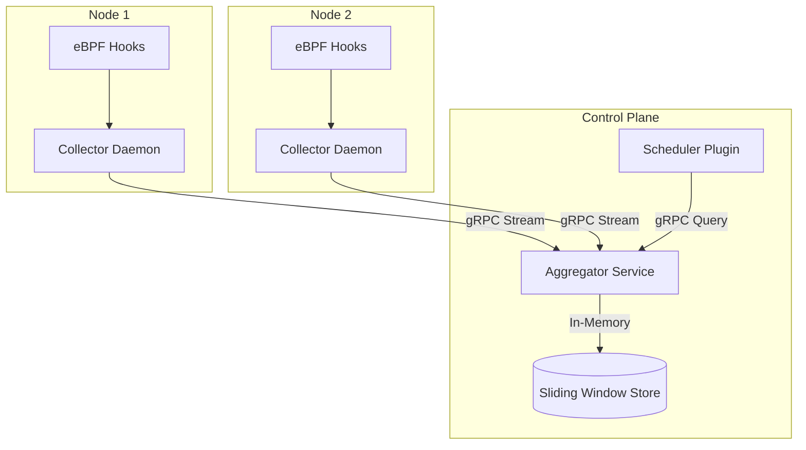

# Architecture

AKIL's architecture is composed of three primary components: the **Collector**, the **Aggregator**, and the **Scheduler Plugin**.

## 1. The Collector (DaemonSet)
The Collector runs on every node in the Kubernetes cluster as a DaemonSet. Its responsibilities are:
1. **eBPF Loading:** Loads compiled eBPF C programs into the Linux kernel (stubbed in Phase 1).
2. **Event Reading:** Reads raw binary events from a shared BPF ring buffer.
3. **Cgroup Resolution:** Maps kernel cgroup IDs to Kubernetes pod identities (Namespace, Pod, Container) by communicating with the local Kubelet API.
4. **Batch Streaming:** Assembles resolved events into batches and streams them to the Aggregator over a persistent gRPC connection to minimize network overhead.

## 2. The Aggregator (Deployment)
The Aggregator is a centralized control plane service. It receives streams of telemetry data from all node collectors concurrently.
1. **Event Processing:** Parses incoming gRPC batches.
2. **Profile Generation:** Maintains an in-memory, sliding-window profile for each Kubernetes workload. Old telemetry data naturally ages out of the buckets, meaning the Aggregator always reflects the current runtime behavior of a workload without requiring a time-series database.
3. **Query Serving:** Exposes a gRPC endpoint that allows the Scheduler Plugin to instantly query the latest runtime profile of any workload.

## 3. The Scheduler Plugin
The AKIL Scheduler Plugin integrates directly into the Kubernetes Scheduling Framework (specifically the `Score` extension point).
1. **Profile Query:** When a new pod is being scheduled, the plugin queries the Aggregator for the historical profile of that pod's workload.
2. **Scoring:** The plugin applies a penalty to candidate nodes based on the metrics. For example, if a node is currently hosting workloads with high lock contention, the plugin will lower the score of that node, encouraging the Kubernetes scheduler to place the new pod elsewhere.

*(Note: In Phase 1, the Scheduler Plugin is implemented as a standalone CLI simulator to demonstrate the scoring logic without requiring a custom compiled Kubernetes API server).*
